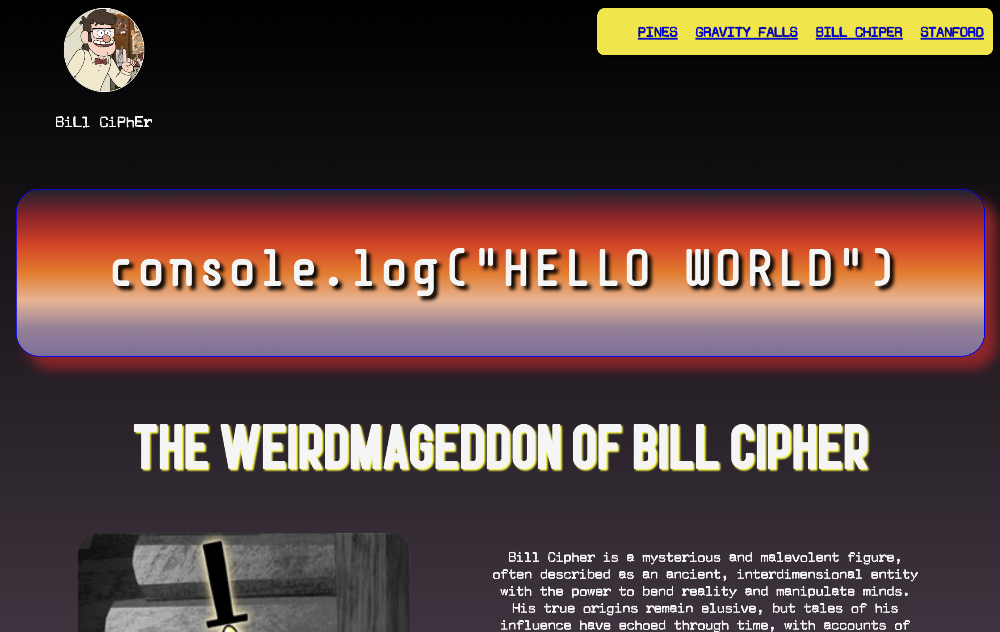
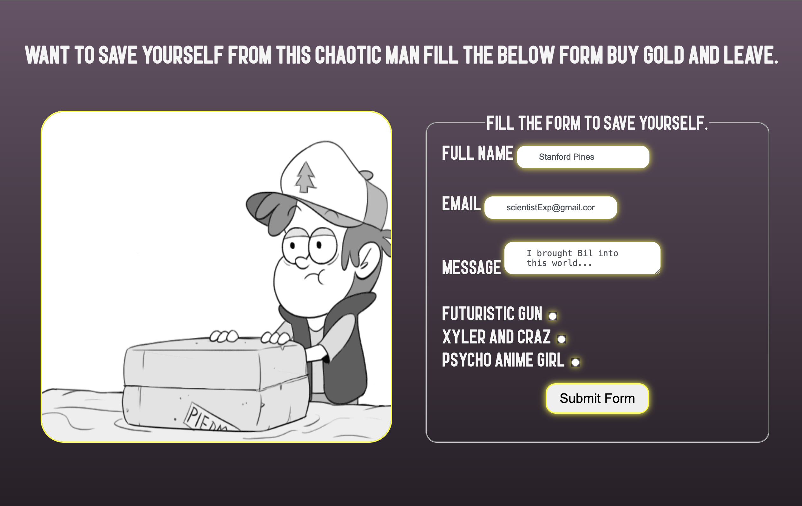

# Bill Cipher 🛸

## Description 📜
Today, I learned how to make websites more accessible using HTML through Scrimba. As part of the learning process, I created this mock website about Bill Cipher, a fictional character from *Gravity Falls*.

## Features ✅ 
- Correct HTML syntax is used throughout the project.
- Font sizes are set using `rem` instead of pixels for better scalability.
- I applied the `linear-gradient()` to enhance the website's design.
- A link has been added to improve keyboard navigation. When the tab button is pressed, the link slides in from the left, and pressing the enter button takes the user to the main section of the webpage.

## Screenshots/Images 📸
### Home:

### Form:
